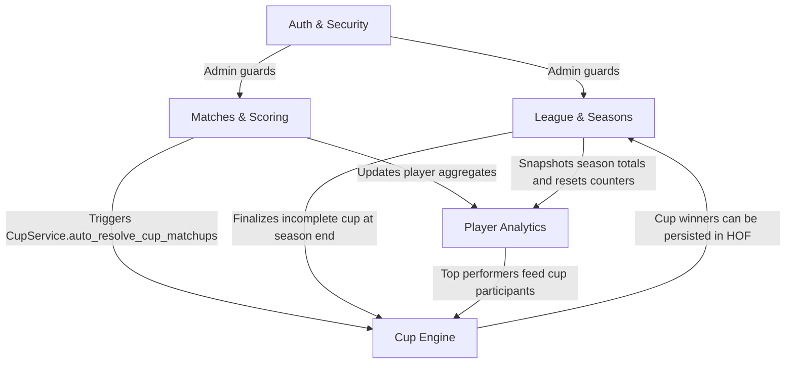

# Fantasy 5-a-Side Documentation

Welcome to the official documentation hub for the Fantasy 5-a-Side project.
This reference explains how modules connect, which contracts they rely on, and where critical operational paths live.

## Quick Start

- [Auth Logic](auth/logic.md)
- [Accounts Logic](accounts/logic.md)
- [Onboarding Logic](onboarding/logic.md)
- [League Logic](league/logic.md)
- [Match Logic](match/logic.md)
- [Cup Logic](cup/logic.md)
- [Project Context](project/context.md)

---

## Documentation Map

| File | Domain | Summary |
| :--- | :----- | :------ |
| [auth/logic.md](auth/logic.md) | Auth | JWT lifecycle, cookie separation, CSRF, audit, revocation |
| [accounts/logic.md](accounts/logic.md) | Accounts | Register, verify, reset password, dashboard ownership |
| [onboarding/logic.md](onboarding/logic.md) | Onboarding | First league setup wizard and ownership guards |
| [league/logic.md](league/logic.md) | League/Season | End/undo season rules, HOF snapshots, tie-breaks |
| [match/logic.md](match/logic.md) | Match/Scoring | Match registration flow, scoring, voting constraints |
| [points/logic.md](points/logic.md) | Points | Points formulas and scoring edge cases |
| [player/logic.md](player/logic.md) | Player | Badges, form, streaks, player analytics |
| [cup/logic.md](cup/logic.md) | Cup | Generation, pairing, auto-resolution, forfeit behavior |
| [transfers/logic.md](transfers/logic.md) | Transfers | Transfer flow and data consistency |
| [media/logic.md](media/logic.md) | Media | Upload, storage modes, fail-fast and cleanup |
| [email/logic.md](email/logic.md) | Email | Queue, fast path, limits, provider behavior |
| [notifications/logic.md](notifications/logic.md) | Notifications | VAPID, subscriptions, async delivery |
| [deployment/logic.md](deployment/logic.md) | Deployment | Render setup, proxy headers, env vars, migration notes |
| [superadmin/logic.md](superadmin/logic.md) | Superadmin | Platform controls and destructive-operation safeguards |
| [project/context.md](project/context.md) | Architecture | System architecture and technical context |
| [project/index.md](project/index.md) | Project Index | Full codebase map and route inventory |
| [project/saas_plan.md](project/saas_plan.md) | SaaS Plan | Product roadmap and platform evolution |

---

## High-Level Dependency Map



---

## High-Level Architecture

```text
HTTP Request
  -> Routers (app/routers/)
  -> Dependencies (app/dependencies.py)
  -> Services / Use Cases (app/services/, app/use_cases/)
  -> Repositories (app/repositories/)
  -> SQLAlchemy Models (app/models/models.py)
  -> Database (SQLite in dev, PostgreSQL in production)
```

Hard rule: every league-scoped query must filter by `league_id`.

---

## Match Registration Full-Impact Flow

This is the highest-throughput write path in the application.

```text
Admin registers a match
  -> MatchService.register_match()
     -> validates teams and participants
     -> creates Match + MatchStat rows
     -> calculates points via strategy layer
     -> updates player seasonal aggregates
     -> increments current season match counter
     -> triggers cup auto-resolution
```

Resolution summary:
- Both players present in a cup fixture: compare points with tie-break fallback.
- One player present: default win.
- Neither present: fixture stays active until normal timeout/forfeit logic.

---

## End Season Pipeline

`LeagueService.end_current_season()` is the most sensitive admin operation.

```text
Admin clicks End Season
  -> guard: season must have at least one match
  -> finalize incomplete cup fixtures
  -> compute winner and side awards
  -> persist HallOfFame snapshot row
  -> snapshot per-player season totals (last_season_*)
  -> add season totals into all_time_*
  -> reset current season totals and flags
```

---

## Undo Pipeline

`LeagueService.undo_end_season()` supports a one-level rollback of the latest end-season action.

```text
Admin clicks Undo Last Season
  -> guard: latest HOF row must exist
  -> guard: non-zero last_season_* snapshot required
  -> delete latest HOF row
  -> restore totals from last_season_*
  -> subtract rollback values from all_time_*
  -> restore season counters
```

> [!CAUTION]
> Undo is intentionally single-level. Snapshot guards prevent unsafe repeated rollback.

---

## Cup Logic Technical Map

Cup behavior spans generation, auto-resolution, progression, and fallback finalization.

```text
GenerateCupUseCase
  -> select eligible players by season points
  -> split GK/outfield brackets (or merge fallback)
  -> apply bye rule for odd player counts
  -> seed pairings with team-collision minimization
  -> persist match-count baseline for forfeit checks

After each match
  -> auto-resolve active cup fixtures
  -> apply tie-break hierarchy when needed
  -> apply forfeit once baseline delta reaches threshold

At season end
  -> finalize incomplete fixtures using standings rules
```

---

## Auth Technical Model

### Admin Login Flow

```text
POST /l/{slug}/admin/login
  -> verify admin password hash
  -> issue league-scoped JWT
  -> set access_token cookie
```

### Request Verification

```text
Any admin route
  -> get_current_admin_league(...)
     -> decode and verify JWT
     -> validate expiration and revocation
     -> enforce token.sub == route league slug
```

### Cookie Separation Table

| Cookie | `sub` payload | Scope | Read by |
| :----- | :------------ | :---- | :------ |
| `access_token` | league slug | admin | `get_current_admin_league` |
| `user_access_token` | user id | user | `get_current_user` |

---

## Player Data Model (Three Layers)

```text
Player row
  - current season totals (total_*)
  - one-level undo snapshot (last_season_*)
  - all-time aggregates (all_time_*)
```

Interpretation:
- `total_*`: current season scoreboard values.
- `last_season_*`: rollback source for undo.
- `all_time_*`: long-term accumulation across ended seasons.

---

## Points Engine

The scoring implementation uses a strategy pattern (`OutfieldStrategy` vs `GoalkeeperStrategy`).

```python
class PointsCalculator:
    def calculate(self, stat):
        strategy = GoalkeeperStrategy() if stat.is_gk else OutfieldStrategy()
        return strategy.compute(stat)
```

Important note: `is_captain` is currently visual/legacy and does not multiply points.

---

## Counter and HOF Synchronization

`league.current_season_matches` is used and reconciled in key admin paths:

```text
current_season_matches
  -> increments on each match registration
  -> is used by season-end guards
  -> can be reconciled against historical snapshots
  -> is persisted in HOF for safe undo restoration
```

---

## High-Risk Admin Operations and Safeguards

| Operation | Main risk | Safeguard |
| :-------- | :-------- | :-------- |
| `end_current_season` | ending empty seasons | guard: `current_season_matches >= 1` |
| `undo_end_season` | all-time corruption via repeated rollback | guard: non-zero snapshot checks |
| `delete_match` | aggregate drift | reverse/recompute aggregate path |
| `edit_match` | vote/participant mismatch | consistency and vote reset protections |
| `generate_cup` | invalid bracket composition | GK merge fallback logic |

---

## Reading Guide by Scenario

### Wrong match was submitted
1. Start with [match/logic.md](match/logic.md).
2. Validate scoring recalculation behavior.
3. Confirm aggregate consistency after edit/delete.

### Cup seems stuck
1. Inspect active fixture state in [cup/logic.md](cup/logic.md).
2. Check baseline and forfeit conditions.
3. Verify season context and bracket visibility logic.

### Player appears in an old cup season
1. Review season sync behavior in [cup/logic.md](cup/logic.md).
2. Verify current `season_number` and query scope.

### End Season clicked by mistake
1. Check undo prerequisites in [league/logic.md](league/logic.md).
2. Confirm snapshot validity before rollback.

### Add a new scoring rule
1. Update `app/services/points.py`.
2. Re-run tests and recompute affected totals.

### Add a new badge
1. Start from [player/logic.md](player/logic.md).
2. Implement rule in `app/services/achievements.py`.
3. Verify data-loading path remains free of N+1 regressions.

### Login/session issue
1. Review [auth/logic.md](auth/logic.md).
2. Verify cookie scope, token revocation, and subject checks.

### HOF award behavior
1. Review [league/logic.md](league/logic.md).
2. Verify ranking/tie-break rules and snapshot fields.

---

## Critical Invariants

| Invariant | Description | Reference |
| :-------- | :---------- | :-------- |
| League isolation | all tenant queries must filter by `league_id` | [league/logic.md](league/logic.md) |
| No empty season end | at least one match is required | [league/logic.md](league/logic.md) |
| Single-level undo | undo depends on one snapshot layer | [league/logic.md](league/logic.md) |
| Cup rows preserved | cup rows remain for historical replay | [cup/logic.md](cup/logic.md) |
| Captain flag is visual | `is_captain` does not alter scoring | [match/logic.md](match/logic.md) |

---

## Code Map

### Auth & Security
| File | Content |
| :--- | :------ |
| `app/core/security.py` | token creation/verification and password helpers |
| `app/core/revocation.py` | token blocklist operations |
| `app/dependencies.py` | auth guards and service wiring |
| `app/routers/auth.py` | login/logout endpoints |

### League & Season
| File | Content |
| :--- | :------ |
| `app/services/league_service.py` | end season, undo season, HOF fix routines |
| `app/repositories/db_repository.py` | `LeagueRepository`, `HallOfFameRepository` |

### Match & Scoring
| File | Content |
| :--- | :------ |
| `app/services/match_service.py` | register/edit/delete/recompute |
| `app/services/points.py` | scoring strategies and breakdown |
| `app/services/voting_service.py` | voting rounds and anti-cheat writes |

### Player & Analytics
| File | Content |
| :--- | :------ |
| `app/services/analytics_service.py` | form, streaks, H2H, chart data |
| `app/services/achievements.py` | badge rules |
| `app/repositories/db_repository.py` | `PlayerRepository` |

### Cup Engine
| File | Content |
| :--- | :------ |
| `app/use_cases/generate_cup.py` | cup generation orchestration |
| `app/services/cup_service.py` | auto-resolution, finalize, forfeit |
| `app/domain/season_boundary.py` | active cup season resolution |
| `app/queries/cup_queries.py` | cup read-model queries |
| `tests/test_cup.py` | cup behavior regression tests |
